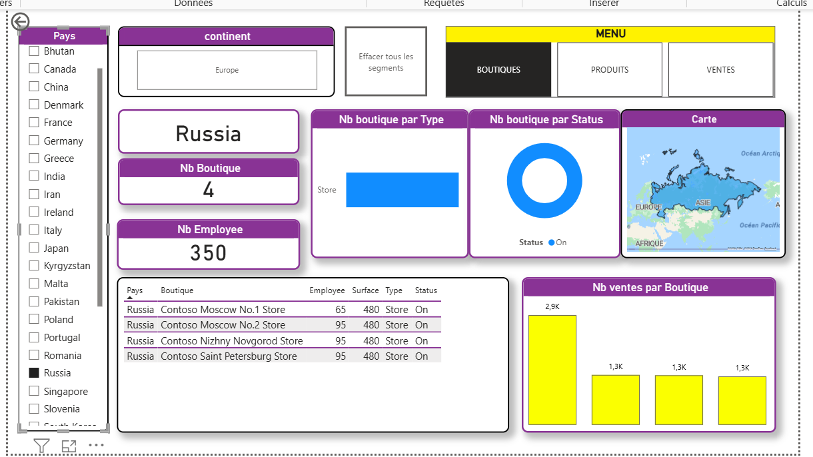
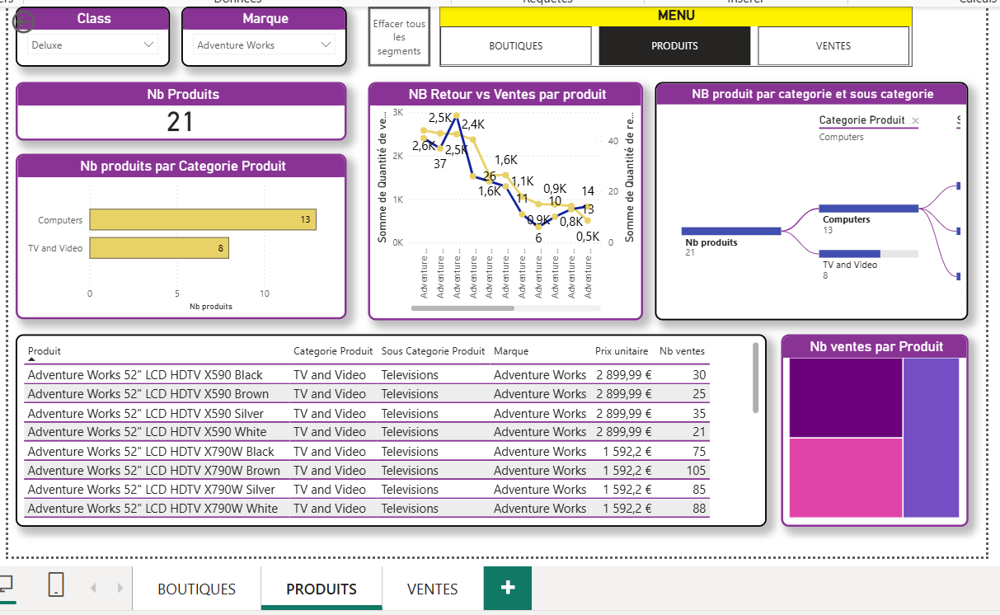

# 📊 Retail Sales Dashboard — Power BI

## 🧾 Project Overview

This Power BI dashboard analyzes retail business performance by exploring **sales, products, and store activity**.
The goal is to transform raw data into clear insights that help understand business trends and support decision-making.

---

## 📸 Dashboard Preview

### 🏬 Boutiques Analysis

### 💰 Sales Performance

### 📦 Products Insights

---

## 🎯 Key Insights

* Identify top-performing boutiques
* Track sales evolution and performance trends
* Analyze best-selling products
* Understand product contribution to revenue

---

## 🛠️ Tools & Skills Used

* Power BI
* Data Visualization
* DAX Measures
* Data Cleaning & Transformation
* Business Analysis

---

## 📈 Business Value

This dashboard helps businesses quickly monitor performance, compare stores, and make data-driven decisions to improve sales strategy.

---

## 👩‍💻 Author

**Aya Zkara**
Aspiring Data Analyst | Power BI Enthusiast
